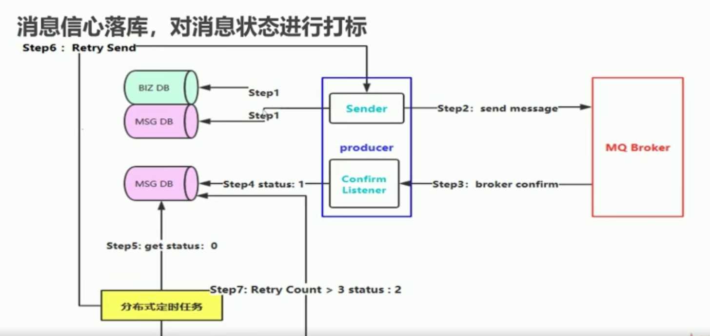
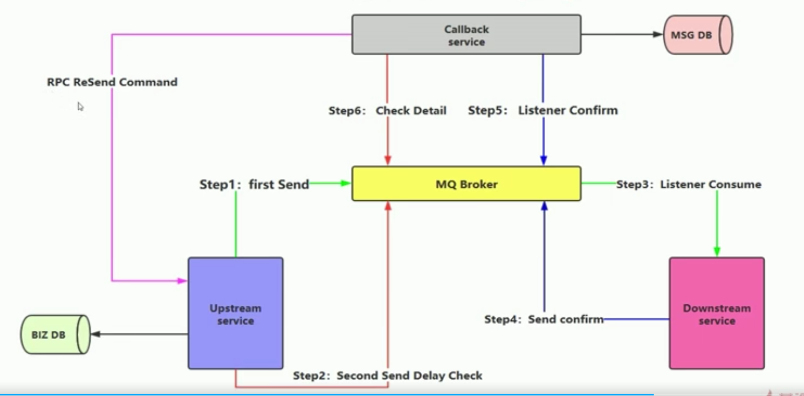

## rabbitmq的安装
- `yum install erlang` 安装erlang环境
- `yum install rabbitmq-server`安装rabbitmq服务
- `chkconfig rabbitmq-server on` 设置开机启动
- `service rabbitmq-server start`启动rabbitmq服务
- `service rabbitmq-server restart` 重启rabbitmq服务
- `service rabbitmq-server stop`关闭rabbitmq服务
- `/usr/lib/rabbitmq`阿里云上rabbitmq的bin路径
- `rabbit.app` 该文件是rabbitmq的配置文件更改为：`loopback_users,[guest]` 
- `/var/log/rabbitmq/rabbit\@Helmet_aliyun.log` 日志文件的位置,可以通过该日志查看链接情况
- 在bin目录下的`rabbitmq-plugins`为rabbitmq的插件，使用`rabbitmq-plugins list`可以查看到默认安装的插件
- `rabbitmq-plugins enable rabbitmq_management` 启动rabbitmq的管理控制台
- `http：//ip:15672`可以访问到rabbitmq的管理控制台，前提是开放15672端口，管理控制台的默认登录用户名密码为guest

## rabbitmq的基本使用
1. 账号的管理
   - `rabbitmqclt add_user <userName> <password>` 新建一个用户及密码
   - `rabbitmqclt list_user` 查看现有的用户列表
   - `rabbitmqclt delete <userName> ` 删除用户
   - `rabbitmqclt change_user <userName> <newpassword>`更改密码
2. 角色管理，rabbitmq有五种角色
- `none`不能进入Web Management,只能发送和接收消息,一般生产者和消费者使用这个角色
- `management`可以通过AMQP做的任何事，列出自己可以通过AMQP登入的virtual hosts，查看自己的virtual hosts中的queues, exchanges 和 bindings，查看和关闭自己的channels 和 connections，查看有关自己的virtual hosts的“全局”的统计信息，包含其他用户在这些virtual hosts中的活动
- `policymaker `management可以做的任何事外，还可以查看、创建和删除自己的virtual hosts所属的policies和parameters
- `monitoring `management可以做的任何事外，列出所有virtual hosts，包括他们不能登录的virtual hosts，查看其他用户的connections和channels，查看节点级别的数据如clustering和memory使用情况，查看真正的关于所有virtual hosts的全局的统计信息
- ` administrator `超级管理员,拥有最高的权限，可以做任何事,guest默认就是超级管理员，并且从3.5版本开始不能使用guest远程登录
   - `rabbitmqctl set_user_tags <username> <tag>`给用户分配角色，默认新建的用户角色为none
   - `rabbitmqctl list_user_permissions <username>` 查看用户权限
   - `rabbitmqctl clear_permissions[-p <vhostpath>] <username>` 清楚用户权限
   - `rabbitmqctl set_permissions [-p <vhostpath>] <user> <conf> <write> <read>`设置用户可访问的虚拟路径的权限，ps:后三个参数可以使用通配符，例如给helmet用户设置访问虚拟主机/，并具有可配置，可读可写的权限 `rabbitmqctl set_permissions -p / helmet ".*" ".*" ".*"`
## rabbitmq组成
1. 消息生产者。
2. 消息。
3. 消息代理（broker)，broker包括:交换机（exchange）、队列（queue）、信道（chanel）、路由键（routtign key）、绑定（binding key）、虚拟机等。
4. 消费者
#### exchange 
交换机有两种状态：持久（durable)，暂存(transient)。持久化的交换机在消息代理（broker）重启后依旧存在。有四种类型的exchange:
- direct（(直连交换机）：生产者与消费者指定一个队列进行一对一生产消费 rabbitmq默认使用该类型，当多个消费者订阅一个队列，但是队列中的消息只能被其中一个消费者消费，当生产者产生大量的消息时，默认使用轮旬的方式公平的分给多个消费者，可以通过设置channel的`basicQos = 1`以及关闭自动应答机制 达到能者多劳的分配方式。
- fanout （扇形交换机）： 将消息路由给绑定到它身上的所有队列，而不理会绑定的路由键。如果有N个队列绑定到某个扇形交换机上，当有消息发送给此扇形交换机时，交换机会将消息的拷贝分别发送给这N个队列。可以用来处理广播路由。
- topic （主题交换机）：通过对消息的路由键和队列到交换机的绑定模式之间的匹配，将消息路由给一个或多个队列。主题交换机经常用来实现各种分发/订阅模式及其变种。
- hearder（头交换机）：头交换机使用多个消息属性来代替路由键建立路由规则。通过判断消息头的值能否与指定的绑定相匹配来确立路由规则。头交换机可以视为直连交换机的另一种表现形式。头交换机能够像直连交换机一样工作，不同之处在于头交换机的路由规则是建立在头属性值之上，而不是路由键。路由键必须是一个字符串，而头属性值则没有这个约束，它们甚至可以是整数或者哈希值（字典）等。
#### queue
1. 存储即将被消费的消息。跟交换机共享一些熟悉，另外也有一些属性：
- Name
- Durable：消息代理重启后，队列依旧存在。
- Exclusive：只被一个连接使用，而且当连接关闭之后队列立即删除。
- Auto-delete：当最后一个消费者退订后立即删除。
- Argument：一些消息代理用来完成类似与TTL的一些额外功能。
队列在声明（declare）后才能被使用。如果一个队列尚不存在，声明一个队列会创建它。如果声明的队列已经存在，并且属性完全相同，那么此次声明不会对原有队列产生任何影响。如果声明中的属性与已存在队列的属性有差异，那么一个错误代码为406的通道级异常就会被抛出。
2. 队列可以进行持久化到磁盘上。
#### Binding
Binding是交换机将消息路由给队列所遵循的规则。如果要指示交换机“E”将消息路由给队列“Q”，那么“Q”就需要与“E”进行绑定。绑定操作需要定义一个可选的路由键（routing key）属性给某些类型的交换机。路由键的意义在于从发送给交换机的众多消息中选择出某些消息，将其路由给绑定的队列。如果AMQP的消息无法路由到队列（例如，发送到的交换机没有绑定队列），消息会被就地销毁或者返还给发布者。如何处理取决于发布者设置的消息属性。
#### channel


## 如何保障消息100%投递成功
1. 生产端的可靠性投递
- 保证消息成功发出
- 保证MQ节点成功接收
- 保证发送端收到MQ节点的确认应答
- 完善的消息补偿机制
2. 解决方案

- 消息持久化落库，对消息状态进行打标，后台轮旬数据库中每没有完成的消息，重发，轮旬次数边界值的设定。由于第一步的两次数据库操作，在分布式高并发场景下，数据库性能瓶颈。
  
- 消息的延迟投递 ，做二次确认，回调检查。step1与step2发送的是同一条消息到不同的队列，并且step2发送的可以根据业务设置相应的延迟时间，step1发送到消息进过消费者消费之后，返回一个新的信息到mq新的队列，callback service 监听该队列，并将消息持久化到msg DB，当step2发送的延迟消息到达mq时，触发对应的监听器，callback service 去msg DB 查找，如果找不到，发起rpc给上游服务器，重新执行。适合分布式高并发场景
  
## 如何避免消费重复消费
1. 消费端实现幂等性，确保消息不会消费多次，即使收到多条一样的消息。

2. 解决方案
- 唯一ID + 指纹码 机制，利用数据库主键去重
  (1). select count(1) from t_order where Id = 唯一Id + 指纹码。 先查找数据，查不到数据insert ,查到就不insert。
- 利用redis的原子性
## Broker Confirm消息确认
通过rabbitmq broker的消息确认机制可以知道消息是否已经送达队列。使用comfirm模式的时候，在生产者中的channel中一定要指定消息的投递模式为confirm，通过代码：`channel.confirmSelect();`channel开启Confirm模式之后，所有在该信道上发布的消息会被指派一个唯一的Id,会以confirm.select为基础从1开始计数，一旦消息投递到匹配的队列之后，broker就会发送一个ack给生产者，包含消息的唯一Id, 如果消息和队列是可持久化的，那么确认消息会将消息写入磁盘之后发出。

有三种消息确认方式：

1.  普通Confirm模式,通过`channel.confirmSelect()`开启消息确认机制，然后使用`channel.waitForConfirms()`接收是否送达的返回值
    ``` // 创建连接
    ConnectionFactory factory = new ConnectionFactory();
    factory.setUsername(config.UserName);
    factory.setPassword(config.Password);
    factory.setVirtualHost(config.VHost);
    factory.setHost(config.Host);
    factory.setPort(config.Port);
    Connection conn = factory.newConnection();
    // 创建信道
    Channel channel = conn.createChannel();
    // 声明队列
    channel.queueDeclare(config.QueueName, false, false, false, null);
    // 开启发送确认模式，当消息投递成功或者失败，rabbitmq的broker会返回一个ack
    channel.confirmSelect();
    String message = String.format("时间 => %s", new Date().getTime());
    channel.basicPublish("", config.QueueName, null, message.getBytes("UTF-8"));
    if (channel.waitForConfirms()) {
        System.out.println("消息发送成功" );
    }

    ```
2.  批量Confirm模式
    ```// 创建连接
    ConnectionFactory factory = new ConnectionFactory();
    factory.setUsername(config.UserName);
    factory.setPassword(config.Password);
    factory.setVirtualHost(config.VHost);
    factory.setHost(config.Host);
    factory.setPort(config.Port);
    Connection conn = factory.newConnection();
    // 创建信道
    Channel channel = conn.createChannel();
    // 声明队列
    channel.queueDeclare(config.QueueName, false, false, false, null);
    // 开启发送确认模式，当消息投递成功或者失败，rabbitmq的broker会返回一个ack
    channel.confirmSelect();
    for (int i = 0; i < 10; i++) {
        String message = String.format("时间 => %s", new Date().getTime());
        channel.basicPublish("", config.QueueName, null, message.getBytes("UTF-8"));
    }
    channel.waitForConfirmsOrDie(); //直到所有信息都发布，只要有一个未确认就会IOException
    System.out.println("全部执行完成");
    ```
3.  异步Confirm模式
    ```// 创建连接
    ConnectionFactory factory = new ConnectionFactory();
    factory.setUsername(config.UserName);
    factory.setPassword(config.Password);
    factory.setVirtualHost(config.VHost);
    factory.setHost(config.Host);
    factory.setPort(config.Port);
    Connection conn = factory.newConnection();
    // 创建信道
    Channel channel = conn.createChannel();
    // 声明队列
    channel.queueDeclare(config.QueueName, false, false, false, null);
    // 开启发送确认模式，当消息投递成功或者失败，rabbitmq的broker会返回一个ack
    channel.confirmSelect();
    for (int i = 0; i < 10; i++) {
        String message = String.format("时间 => %s", new Date().getTime());
        channel.basicPublish("", config.QueueName, null, message.getBytes("UTF-8"));
    }
    //异步监听确认和未确认的消息
    channel.addConfirmListener(new ConfirmListener() {
        @Override
        public void handleNack(long deliveryTag, boolean multiple) throws IOException {
            System.out.println("未确认消息，标识：" + deliveryTag);
        }
        @Override
        public void handleAck(long deliveryTag, boolean multiple) throws IOException {
            System.out.println(String.format("已确认消息，标识：%d，多个消息：%b", deliveryTag, multiple));
        }
    });
    ```

## Broker Return消息机制 

return消息机制可以监听不可路由的消息，与comfirm模式的区别在于comfirm监听的是队列是路由可达的情况下时候到达了指定的队列中，return监听的是消息能否路由到队列中。

```java
channel.addReturnListener(new ReturnListener() {
			@Override
			public void handleReturn(int replyCode, String replyText, String exchange,
					String routingKey, BasicProperties properties, byte[] body) 
					throws IOException {
				
				System.err.println("---------handle  return----------");
				System.err.println("replyCode: " + replyCode);
				System.err.println("replyText: " + replyText);
				System.err.println("exchange: " + exchange);
				System.err.println("routingKey: " + routingKey);
				System.err.println("properties: " + properties);
				System.err.println("body: " + new String(body));
			}
		});
//设置Mandatory：如果为true，则监听器会接收到路由不可达的消息，然后进行后续处理，如果为false，那么broker端自动删除该消息
		channel.basicPublish(exchange, routingKey, true, null, msg.getBytes());
```

## Consumer Confirm消息确认
消费者断进行ack确认可以确保消费被消费者消费，broker的只有在收到消费者返回的ack之后才会在队列中删除对应的消息。有两种模式，自动ack和手动ack。
1. 自动ack.只需要在`channel.basicConsume(queueName, true, queueingConsumer);`的第二个参数用指定为true,使用自动确认，broker认为 message 一旦被 deliver 出去了，就已被确认了，所以会立即将缓存中的 message 删除。所以在 consumer 异常时会导致消息丢失。
2. 手动确认。手动确认又分为两种，一种是肯定确认，一种是否定确认
    （1）肯定确认,在消费者端的channel上使用代码：
```java
//fasel使用手动确认
channel.basicConsume(queueName, false, new MyConsumer(channel));
    //deliveryTag 传递标签,ulong 类型.它的范围隶属于每个信道.因此必须在收到消息的相同信道上确认.不同的信道将导致“未知的传递标签”协议异常并关闭通道.
    //multiple 确认一条消息还是多条.false 表示只确认envelope.getDeliveryTag() 这条消息,true表示确认 小于等于 envelope.getDeliveryTag()的所有消息 
    channel.basicAck(envelope.getDeliveryTag(), false);
```
​      （2） 否定确认。否定确认的场景不多,但有时候某个消费者因为某种原因无法立即处理某条消息时,就需要否定确认了。否定确认时,需要指定是丢弃掉这条消息,还是让这条消息重新排队,过一会再来,又或者是让这条消息重新排队,并尽快让另一个消费者接收并处理它。
   - 丢弃

     ```java
     //requeue：false丢弃
     channel.basicNack(deliveryTag: e.DeliveryTag, multiple: false, requeue: false);
     ```

- 重回队列

  ```java
  //requeue：true重回队列
  channel.basicNack(deliveryTag: e.DeliveryTag, multiple: false, requeue: false);
  ```

## Consumer 限流

当客户端处理消息的能力有限的时候，可以做consumeer的限流。在consumer定义的channel上

```
//通过设定prefetchCount为1，broker一次只发送一条消息到consumer中，只有当这条消息返回ack之后才继续发送
channel.basicQos(0, 1, false);
// 限流时autoAck设置为 false，MyConsumer是一个继承DefaultConsumer的自定义consumer,可以解耦，在重载方法中handleDelivery()处理消费的逻辑。
channel.basicConsume(queueName, false, new MyConsumer(channel));
```

## 死信队列
当消息变成一个死信之后，如果这个消息所在的队列存在x-dead-letter-exchange参数，那么它会被发送到x-dead-letter-exchange对应值的交换器上，这个交换器就称之为死信交换器，与这个死信交换器绑定的队列就是死信队列。
成为死信消息有三种情况：
1. 消息被拒绝（basicReject或者basicNack,并且设置 requeue 参数的值为 false。

2. 消息过期。有两种方式可以设置过期时间，一种通过队列设置，另一种直接通过消息的properties属性设置。

   - 单个消息的设置。

   ```
   AMQP.BasicProperties properties = new AMQP.BasicProperties.Builder()
   				.deliveryMode(2) //消息会持久化，如果是1,不持久
   				.contentEncoding("UTF-8") //字符集
   				.expiration("10000") //过期时间,指定时间内没有被消费，自动删除消息
   				.headers(headers) //自定义的属性
   				.build();
   String msg = "Hello RabbitMQ!";
   channel.basicPublish("", "test-properties", properties, msg.getBytes());
   ```

   -  在队列申明的时候使用 x-message-ttl 参数，单位为 毫秒 。

3. 队列达到最大长度。

死信队列的设置

```
Channel channel = connection.createChannel();
		
        // 这就是一个普通的交换机 和 队列 以及路由
String exchangeName = "test_dlx_exchange";
String routingKey = "dlx.#";
String queueName = "test_dlx_queue";

channel.exchangeDeclare(exchangeName, "topic", true, false, null);

Map<String, Object> agruments = new HashMap<String, Object>();
agruments.put("x-dead-letter-exchange", "dlx.exchange");
//这个agruments属性，要设置到声明队列上
channel.queueDeclare(queueName, true, false, false, agruments);
channel.queueBind(queueName, exchangeName, routingKey);

//要进行死信队列的声明:
channel.exchangeDeclare("dlx.exchange", "topic", true, false, null);
channel.queueDeclare("dlx.queue", true, false, false, null);
channel.queueBind("dlx.queue", "dlx.exchange", "#");

channel.basicConsume(queueName, true, new MyConsumer(channel));
```

可以利用死信队列以及过期时间做延时队列，根据需求，给消息设置对应的过期时间，并给该队列声明一个`x-dead-letter-exchange`属性，当过期时间一到，消息进入对应的死信队列，消费者就只需要监听死信队列消费，就可以达到延时队列的效果。如下图：


## rabbitmq 集群架构模式
1. 主备模式（并发数据量不大的时候使用），一主多备，主节点提供读写，只有当主节点挂掉之后，备份节点才升为主节点
2. 远程模式
  
3. 镜像模式
  - 准备rabbitmq三个节点,按正常启动后，停止三个节点的服务`rabbitmqctl stop`
  - 把其中准备作为Master节点的cookie文件复制到另外两个节点中 `scp /var/lib/rabbitmq/.erlang.cookie ip:/var/lib/rabbitmq/`
  - 确保已经修改每个节点的主机名 `vi /etc/hostname` 每个节点所在的主机名可以自定义
  - `rabbitmq-server -detached` 启动每一个节点
  - 另外连个节点相应执行以下命令 ，加入到主节点中`rabbitmqctl stop_app`  `rabbitmqctl join_cluster rabbit@{master 的host name}` `rabbitmqctl start_app`
  - 执行镜像队列复制 `rabbitmqctl set_policy ha-all "^" ' {"ha-mode":"all"}`
  - 修改集群的名字（任意一个节点） `rabbitmqctl set_cluster_name {name}`
  - 查看集群状态(任意一个节点) `rabbitmqctl cluster_status`
  - 
  - 使用HAProxy 进行负载均衡
  - 用新的两个节点 安装HAProxy
  - 使用KeepAlived 实现高可用，解决HAProxy单点故障
  - 在HAProxy节点中安装KeepAlived
  - 延迟插件的使用，指定延迟时间

  - 具体实现
  > 1. 准备三个机器节点 
  > 2. 在其中一个机器上准备环境 
    `yum install build-essential openssl openssl-devel unixODBC unixODBC-devel make gcc gcc-c++ kernel-devel m4 ncurses-devel tk tc xz `
  > 3. 安装erlang 
    `yum install erlang`
  > 4. 安装rabbitmq 服务
    `yum install rabbitm-server`
  > 5. 安装socat 
    `yum install socat`
  > 6. 修改rabbitmq的配置文件，根据安装的rabbitmq版本有差异，本次测试版本为rabbitmq_server-3.3.5
    `vi /usr/lib/rabbitmq/lib/rabbitmq_server-3.3.5/ebin/rabbit.app` 
    loopback_users 的值改为  loopback_users [guest]
    heartbeat  的值改为 1
  > 7.

4. 多活模式

## set（单元化架构）
 - 不同集群中节点的通信 federation插件
